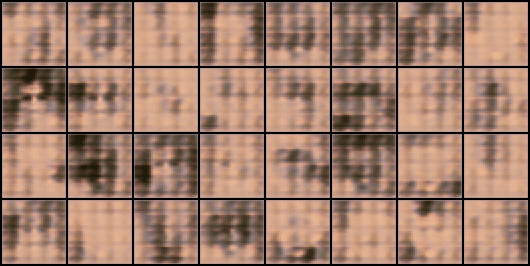

## Notes

It takes quite some time to train. On `LEARNING_RATE=5e-5`, `BATCH_SIZE=64` it took around 20 steps to produce acceptable quality results on `CelebA HQ` dataset.
Initial result may lead to believe that model is not training. Both generator and critic loss can be negative. I see this based on per mini batch generator and critic loss. 

Assuming tensorboard is installed with tensorflow or separately. Monitoring progress in tensorboard in windows,

```
tensorboard --logdir=C:\GAN\logs --host localhost --port 8088
```

In browser head to, http://localhost:8088/ to see tensorboard.

<br>

## Results




<br>


## TODO

- Read paper and add reference notes.
- Explore per epoch average loss.
- Weight saving and loading with inference.
- Latent space control to generate random images.
- Interpolate between images.
- Command line arguments for running custom dataset.

<br>


## References

- WGAN and WGAN-GP implementation, https://www.youtube.com/watch?v=pG0QZ7OddX4.
- WGAN paper, https://arxiv.org/abs/1701.07875.
- DCGAN implementation, https://www.youtube.com/watch?v=IZtv9s_Wx9I.
- DCGAN paper, https://arxiv.org/abs/1511.06434.
- GAN implementation, https://www.youtube.com/watch?v=OljTVUVzPpM.
- GAN paper, https://arxiv.org/abs/1406.2661.
